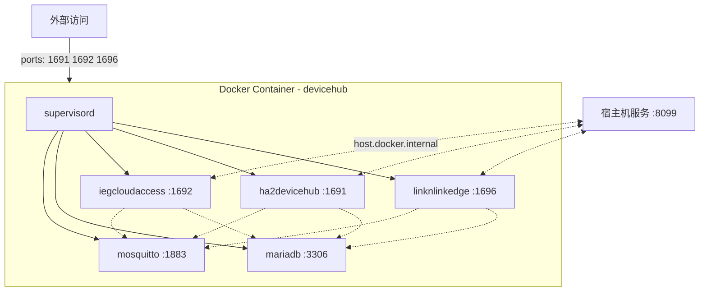

# DeviceHub Addon 实施方案

## 背景

创建名为 `devicehub` 的 addon，将 3 个业务服务和 2 个依赖服务打包为单个 Docker 容器运行。使用 **bridge 网络 + host-gateway** 模式实现端口隔离和宿主机访问。

---

## 架构设计



### 网络方案：bridge + host-gateway

- **容器内部**：各服务通过 `127.0.0.1` 互相访问（同一容器内）
- **访问宿主机**：通过 `host.docker.internal` 访问宿主机服务（如 `:8099`）
- **端口暴露**：仅映射 `1691`、`1692`、`1696` 到宿主机，供外部访问 Web 页面
- mosquitto(1883) 和 mysql(3306) **不暴露**到宿主机，避免端口冲突

### 启动顺序

`mosquitto`(priority=10) → `mariadb`(priority=20) → 等待 MySQL 就绪 + 初始化数据库 → 3 个业务服务(priority=30)

---

## 文件结构

```
addons/devicehub/
├── VERSION
├── README.md
├── docker-compose.yml                          # 本地构建用
├── common/
│   ├── Dockerfile
│   ├── bin/                                    # 【手动放置】预编译可执行文件
│   │   ├── iegcloudaccess
│   │   ├── ha2devicehub
│   │   └── linknlinkedge
│   ├── frontend/                               # 【手动放置】前端页面文件
│   │   ├── iegcloudaccess/                     # ← 来自 iegcloudaccess/frontend/
│   │   │   └── index.html
│   │   ├── ha2devicehub/                       # ← 来自 ixgsubservice/src/module/ha2devicehub/frontend/
│   │   │   ├── index.html
│   │   │   ├── script.js
│   │   │   ├── styles.css
│   │   │   └── config.js
│   │   └── linknlinkedge/                      # ← 来自 linknlinkedge/web/
│   │       ├── index.html
│   │       ├── simple_dashboard.html
│   │       └── unified_dashboard.html
│   └── rootfs/
│       ├── etc/
│       │   ├── mosquitto/
│       │   │   └── mosquitto.conf
│       │   ├── iegcloudaccess/
│       │   │   └── output/
│       │   │       └── iegcloudaccess.toml
│       │   ├── ha2devicehub/
│       │   │   └── output/
│       │   │       └── ha2devicehub.toml
│       │   └── linknlinkedge/
│       │       └── config.yaml
│       └── app/
│           ├── docker-entrypoint.sh
│           ├── init-db.sh
│           ├── database_init.sql           # linknlinkedge 建表脚本
│           └── supervisord.conf
└── template/
    ├── config.json
    ├── docker-compose.yml
    ├── README.md
    ├── DOCS.md
    └── icon.png
```

---

## 各文件详情

### Dockerfile

基于 `debian:bookworm-slim`，步骤：
1. 安装 `mosquitto`、`mariadb-server`、`supervisor`
2. COPY `bin/*` → 各服务的 `/etc/<服务名>/` 目录
3. COPY `frontend/*` → 各服务的前端目录
4. COPY `rootfs/` → `/`（配置文件和脚本）
5. ENTRYPOINT 执行 `docker-entrypoint.sh`

### 数据持久化方案

| 数据 | 是否持久化 | 原因 | 容器内路径 |
|------|----------|------|-----------|
| **MySQL 数据** | ✅ 必须 | 设备信息、用户配置等核心数据，丢失不可恢复 | 容器内 `/var/lib/mysql` |
| **Mosquitto 数据** | ✅ 建议 | retained messages 保存设备最新状态，重启后客户端可立即获取 | 容器内 `/var/lib/mosquitto` |
| **服务配置文件** | ❌ 不需要 | 配置文件已内置在镜像中，随镜像版本更新 | — |
| **服务日志** | ❌ 不需要 | 通过 `docker logs` 查看(supervisord 输出到 stdout) | — |

### docker-compose.yml（本地构建）

```yaml
services:
  devicehub:
    build:
      context: ./common
    container_name: devicehub
    restart: unless-stopped
    extra_hosts:
      - "host.docker.internal:host-gateway"
    ports:
      - "1691:1691"    # ha2devicehub Web
      - "1692:1692"    # iegcloudaccess Web
      - "1696:1696"    # linknlinkedge Web
    volumes:
      - devicehub_mysql:/var/lib/mysql              # 容器内标准路径
      - devicehub_mosquitto:/var/lib/mosquitto      # 容器内标准路径

volumes:
  devicehub_mysql:          # 实际存储在宿主机 /var/lib/docker/volumes/devicehub_mysql
  devicehub_mosquitto:      # 实际存储在宿主机 /var/lib/docker/volumes/devicehub_mosquitto
```

### 配置文件对照

| 服务 | 配置文件 | MQTT 地址 | MySQL 地址 | 宿主机服务地址 | HTTP 端口 |
|------|---------|-----------|-----------|--------------|----------|
| iegcloudaccess | `iegcloudaccess.toml` | `tcp://127.0.0.1:1883` | `127.0.0.1:3306` | `host.docker.internal:8099` | :1692 |
| ha2devicehub | `ha2devicehub.toml` | `tcp://127.0.0.1:1883` | `127.0.0.1:3306` | `host.docker.internal:8099` | :1691 |
| linknlinkedge | `config.yaml` | `tcp://127.0.0.1:1883` | `127.0.0.1:3306` | `host.docker.internal:8099` | :1696 |

> [!NOTE]
> 容器内服务间通信用 `127.0.0.1`，访问宿主机用 `host.docker.internal`。

### supervisord.conf

| 进程 | priority | autorestart | startsecs | 工作目录 |
|------|----------|-------------|-----------|---------|
| mosquitto | 10 | true | 2 | / |
| mariadb | 20 | true | 5 | / |
| iegcloudaccess | 30 | true | 5 | /etc/iegcloudaccess |
| ha2devicehub | 30 | true | 5 | /etc/ha2devicehub |
| linknlinkedge | 30 | true | 5 | /etc/linknlinkedge |

### init-db.sh — 数据库初始化方案

由于容器内没有 deb 安装流程，原各服务 postinst 中的数据库初始化逻辑需要由 `docker-entrypoint.sh` 在首次启动时执行。

**执行时机**：`docker-entrypoint.sh` 启动 MariaDB 后、启动业务服务前，调用 `init-db.sh`。使用标记文件 `/var/lib/mysql/.db_initialized` 避免重复执行。

**初始化内容**（从 postinst 脚本提取）：

| 数据库 | 用户 | 密码 | 用户 Host | 额外操作 |
|--------|------|------|-----------|---------|
| `iegcloudaccess` | `iegcloudaccess` | `iegcloudaccesspwd` | `127.0.0.1` | `MAX_USER_CONNECTIONS 128` |
| `ha2devicehub` | `ha2devicehub` | `ha2devicehubpwd` | `127.0.0.1` | `MAX_USER_CONNECTIONS 128` |
| `linknlink_edge` | `linknlink` | `a1b2c3d4` | `localhost` | 执行 `database_init.sql` 建表 |

> [!NOTE]
> `linknlinkedge` 还需额外执行 [database_init.sql](file:///home/linknlink/1_codes/src/cloud/linknlinkedge/docs/database_init.sql) 创建 5 张表（`devices`、`device_registry`、`entities`、`current_states`、`state_history`）。该 SQL 文件需要 COPY 到容器内。

### template/config.json

```json
{
    "name": "DeviceHub",
    "version": "1.0.0",
    "slug": "devicehub",
    "description": "物联网设备中心服务集合",
    "startup": "services",
    "boot": "auto",
    "ingress": true,
    "ingress_port": 1691
}
```

---

## Verification Plan

1. 放入编译好的可执行文件到 `common/bin/` 和前端文件到 `common/frontend/`
2. `docker compose build` 构建镜像
3. `docker compose up -d` 启动容器
4. `docker exec devicehub supervisorctl status` — 验证 5 个进程 RUNNING
5. 浏览器访问 `http://<host>:1691`、`:1692`、`:1696` 验证 Web 页面
6. `docker exec devicehub mysql -uroot -p... -e "SHOW DATABASES;"` 验证数据库
