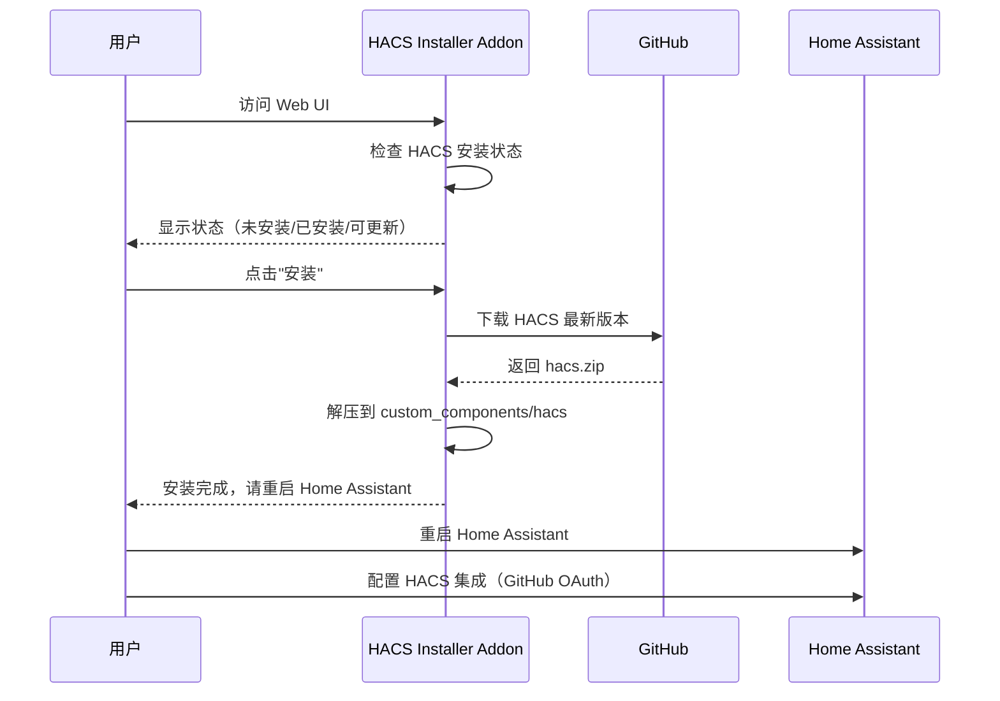

# HACS 部署方案分析

## 问题背景

用户希望将 HACS (Home Assistant Community Store) 以 Haddons 服务中的独立 addon（容器）方式部署，HomeAssistant 本身运行在 Docker 容器中。

## 技术分析

### HACS 的本质

经过调研，HACS **不是一个独立服务**，而是一个 **Home Assistant 集成（Integration）**：

```
custom_components/
└── hacs/
    ├── __init__.py
    ├── manifest.json
    ├── sensor.py
    └── ... (其他文件)
```

> [!IMPORTANT]
> **HACS 无法作为独立容器运行**
> 
> HACS 必须安装在 Home Assistant 的 `custom_components` 目录内，因为它：
> 1. 需要访问 Home Assistant 的内部 API
> 2. 需要直接操作 `custom_components` 目录来安装/管理其他集成
> 3. 集成到 Home Assistant 的前端界面和侧边栏

### 标准 HACS 安装方式

对于 Docker 运行的 Home Assistant：

```bash
# 1. 进入 HA 容器
docker exec -it homeassistant bash

# 2. 运行安装脚本
wget -O - https://get.hacs.xyz | bash -

# 3. 退出并重启容器
exit
docker restart homeassistant
```

然后在 Home Assistant UI 中配置 HACS 集成（需要 GitHub OAuth 认证）。

---

## 可行的部署方案

考虑到 HACS 无法独立容器化运行，以下是几个可行的替代方案：

### 方案一：HACS 安装器 Addon（推荐）

创建一个 Haddons addon，用于**自动化安装/更新 HACS** 到 Home Assistant 容器中。

#### 工作原理

```mermaid
graph LR
    A[hacs-installer addon] -->|挂载 HA 目录| B[/homeassistant/config]
    A -->|下载 HACS| C[GitHub Releases]
    A -->|安装到| D[custom_components/hacs]
    E[用户] -->|点击安装| A
```

#### 技术实现

| 组件 | 说明 |
|------|------|
| **docker-compose.yml** | 挂载 HA 的配置目录 |
| **安装脚本** | 下载并解压 HACS 到目标目录 |
| **Web UI** | 提供安装/更新/状态查看界面 |

#### 优点

- 符合 Haddons addon 架构
- 一键安装/更新 HACS
- 可提供版本管理功能

#### 缺点

- 安装后仍需在 HA 中手动配置 HACS 集成
- 需要正确配置 HA 配置目录挂载

---

### 方案二：HACS 管理器 Addon

创建一个更完整的管理器，不仅安装 HACS，还提供：

- HACS 版本检查和更新
- 自动备份 custom_components
- 安装状态监控
- 可选：代理 GitHub 下载（解决网络问题）

---

### 方案三：Home Assistant 预配置镜像

如果您管理多个 Home Assistant 实例，可以：

1. 创建预装 HACS 的 Home Assistant Docker 镜像
2. 通过自定义镜像分发

---

## 推荐方案详细设计

采用 **方案一：HACS 安装器 Addon**

### 目录结构

```
addons/hacs-installer/
├── config.json              # Haddons 配置
├── docker-compose.yml       # 容器编排
├── VERSION                  # 版本号
├── README.md               # 说明文档
└── common/
    ├── Dockerfile          # 构建文件
    └── rootfs/
        └── app/
            ├── docker-entrypoint.sh  # 入口脚本
            ├── install-hacs.sh       # HACS 安装脚本
            └── web/                   # Web UI
                ├── app.py            # Flask 应用
                └── templates/
                    └── index.html    # 管理界面
```

### 关键配置

#### docker-compose.yml

```yaml
services:
  hacs-installer:
    build:
      context: ./common
      dockerfile: Dockerfile
    container_name: hacs-installer
    restart: unless-stopped
    ports:
      - "8080:8080"
    volumes:
      # 挂载 Home Assistant 配置目录
      - ${HA_CONFIG_PATH:-/var/lib/homeassistant}:/homeassistant:rw
    environment:
      - HA_CONFIG_PATH=/homeassistant
```

#### config.json

```json
{
  "name": "HACS Installer",
  "version": "1.0.0",
  "slug": "hacs_installer",
  "description": "一键安装和管理 HACS (Home Assistant Community Store)",
  "arch": ["aarch64", "amd64", "armv7"],
  "startup": "services",
  "boot": "manual",
  "options": {
    "ha_config_path": "/var/lib/homeassistant"
  },
  "schema": {
    "ha_config_path": "str"
  }
}
```

### 核心功能

1. **检测 HACS 状态**：检查 `custom_components/hacs` 是否存在
2. **安装 HACS**：从 GitHub 下载最新版本并解压
3. **更新 HACS**：检查并安装新版本
4. **提示重启**：安装后提示用户重启 Home Assistant

---

## 用户操作流程



---

## 需要用户确认的事项

1. **Home Assistant 配置目录路径**
   - 您的 Home Assistant 配置目录在哪里？
   - 例如：`/home/user/homeassistant` 或 `/var/lib/homeassistant`

2. **是否需要 GitHub 代理功能？**
   - 如果网络访问 GitHub 有困难，可以添加代理下载功能

3. **是否需要自动备份功能？**
   - 安装前自动备份 custom_components 目录

4. **确认方案选择**
   - 方案一（HACS 安装器）是否满足需求？
   - 或者需要更完整的方案二？

---

## 验证计划

### 手动测试

1. **构建测试**
   ```bash
   cd addons/hacs-installer
   docker-compose up --build
   ```

2. **功能测试**
   - 访问 `http://localhost:8080`
   - 验证 HACS 安装状态检测
   - 验证安装/更新功能
   - 检查 `custom_components/hacs` 目录

3. **集成测试**
   - 在真实 Home Assistant 环境中测试
   - 验证 HACS 安装后的配置流程
